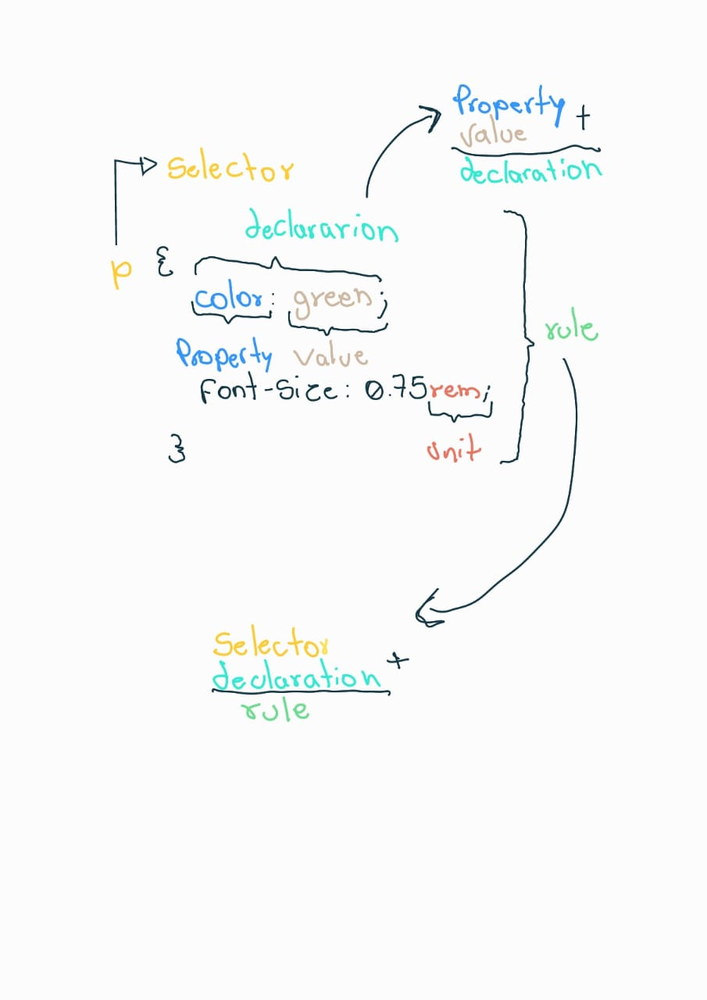

# Terminologia da anatomia de uma regra de estilo

Dado o seguinte código CSS:

```css
p {
  color: green;
  font-size: 0.75rem;
}
```

temos as seguintes terminologias:

- **Rule** (regra): é coleção de declarações e um ou mais seletores. Ou seja, todo o código acima.

- **Declaration** (declaração): é a combinação de uma propriedade mais um valor. Ex: _`color: green`_

- **Selector** (seletor): é o descritor que especifica o alvo de um elemento na página, pode ser, um **id**, **class** ou elemento html. Ex. `p` `.paragraph` `#my-id`.

- **Property** (propriedade): São atributos que você pode especificar um valor. Ex: `color`, `font-size`, `margin`.

- **Values** (valores): São caracteristicas atribuidas ao uma propriedade. Ex: `green`, `0.75rem`.

- **Units** (unidades): São unidades de medida utilizadas em algumas propriedades. Ex: `rem`, `px`, `em`, `%`.

Resumo:


