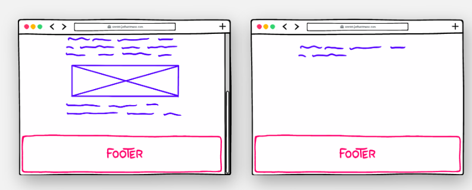

## Height Algorithms

Funciona da mesma maneira que width, contudo com uma pequena diferença.
`Height` está muito mais próximo do `width: min-content` do que do `width: auto`.

É uma propriedade muito mais dinamica que o tamanho, pois o objetivo é preencher tanto algo que tenha 200 letras quanto 20 mil letras.
Por isso sempre evitamos colocar heights fixos.
se não podemos ter o seguinte problema apresentado no exemplo

```html
<style>
  section {
    height: 100px;
    max-width: 300px;
    border: solid;
  }
</style>

<section>
  <p>
    Constraining height is generally a bad idea, because we usually don't know
    how much space the element's content will take up! This paragraph is
    breaking out of its box, because we've constrained its height to just 100
    pixels.
  </p>
</section>
```

Mas quando queremos definir uma altura mínima??

Vamos dizer que queremos que corpo do nosso conteúdo ocupe 100% da tela, mas esse corpo não tem o tamanho necessario, deixando o footer por exemplo em uma lugar "ruim".



Nosso objetivo é colocar um elemento `wrapper`, que não deve ser menor que 100% do espaço livre. Mas se colocarmos `min-height: 100%` não irá funcionar:

```html
<style>
  .wrapper {
    min-height: 100%;
    border: solid;
  }
</style>
<section class="wrapper">
  <p>I'm not very tall!</p>
</section>
```

Como já vimos o comportamento padrão de um elemento em termos de altura é ser o menor possivel para caber o filho.

Nossa section está dentro da tag body e, portanto, quando definimos uma altura baseada em porcentagem ou altura minima, a porcentgem é baseada na altura do pai.
`<body>` não tem uma altura específica definida, o que significa que ele usa o comportamento padrão: ficando o mais curto possível, enquanto ainda contém todos os filhos.

O que devemos fazer:

- Colocar uma `height: 100%` em cada elemento antes do seu pai (isso inclui html e body)
- Colocar um `min-height: 100%` no wrapper
- Não tente usar alturas baseadas em procentagem dentro desse wrapper (height: 100%, 50%)

```html
<style>
  html,
  body {
    height: 100%;
  }
  .wrapper {
    min-height: 100%;
    border: solid;
  }
</style>
<section class="wrapper">
  <p>I'm not very tall!</p>
</section>
```

Quando o html recebe `height: 100%` ele irá receber altura total do viewpor (tela), body consequentemente irá herdar o tamanho do html e assim sucessivamente para os próximos elementos.

### Mas e o footer?

Comum de UI é ter o footer embaixo: então uma abordagem que podemos seguir é essa.
